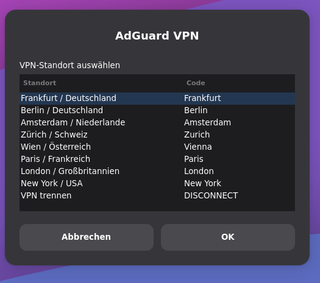
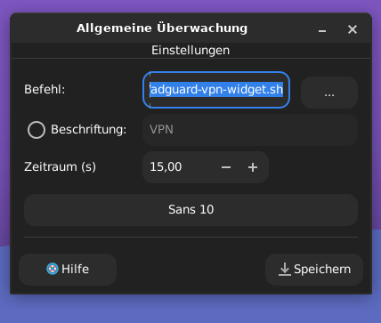

# AdGuard-VPN-XFCE-Genmon-Widget
A lightweight XFCE Genmon widget for controlling and monitoring AdGuard VPN directly from the panel.

## Screenshot






## Features

* Displays the current VPN status directly in the XFCE panel.
* Shows the active VPN location (e.g. Frankfurt, Berlin, Paris).
* Color-coded status:

  * 🟢 Connected
  * 🔴 Disconnected
* Click to open a location selection menu.
* Connect, disconnect, and switch locations without opening a terminal.
* Uses the official AdGuard VPN Linux CLI.
* Built with Bash and Zenity.

## Requirements

* Debian 13 (or compatible Linux distribution)
* XFCE Desktop Environment
* xfce4-genmon-plugin
* Zenity
* AdGuard VPN CLI

## Installation

Install Zenity:

```bash
sudo apt install zenity
```

Ensure the AdGuard VPN CLI is installed and working:

```bash
adguardvpn-cli status
```

Make both scripts executable:

```bash
chmod +x ~/.local/bin/adguard-vpn-widget.sh
chmod +x ~/.local/bin/adguard-vpn-select.sh
```

## XFCE Genmon Configuration

Command:

```text
/home/USERNAME/.local/bin/adguard-vpn-widget.sh
```

Refresh interval:

```text
15
```

Enable:

```text
Use markup
```

## Usage

### Connected

```text
VPN BERLIN
```

### Disconnected

```text
VPN aus
```

Clicking the widget opens a selection dialog where you can:

* Connect to another VPN location
* Switch between countries and cities
* Disconnect from the VPN

## Supported Locations

Example locations included by default:

* Frankfurt (Germany)
* Berlin (Germany)
* Amsterdam (Netherlands)
* Zurich (Switzerland)
* Vienna (Austria)
* Paris (France)
* London (United Kingdom)
* New York (United States)

Additional locations can easily be added by editing the location list in:

```bash
~/.local/bin/adguard-vpn-select.sh
```

## Screenshot

Example panel display:

```text
VPN PARIS
```

## License

MIT License
